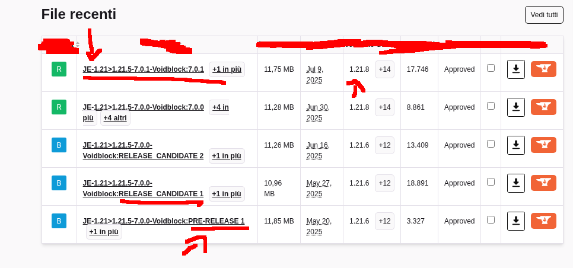

## FAQ (Domande e Risposte):

### Domande Generali:

# Domanda: Come si scarica una custom maps?

> _**Risposta**: Per scaricare una custom maps di Minecraft, puoi seguire questa guida nella [wikipedia di Minecraft](https://minecraft.wiki/wiki/Tutorials/Map_downloads)._
>
> _Tuttavia se vuoi usare un nuovo mondo invece di quello predefinito, segui questi semplici passaggi (solo per alcune mappe come la [Voidblock](https://github.com/Loweredgames/Voidblock)): Apri la cartella zip della mappa e copia la cartella ```datapack``` e il file zip ```resources```. Quindi crea un mondo in Minecraft, modificando il ```seed``` e attivando **i cheat del mondo** se no non funzionano le ```scoreboard```. Apri la cartella del nuovo mondo e incolla tutte le cartelle che hai copiato. Avvia Minecraft e vai in giocatore singolo e la mappa dovrebbe apparire._

*Video: Come si scarica una custom maps:*

<iframe width="854" height="480"
  src="https://www.youtube.com/embed/4Igv2GD5bdY"
  frameborder="0"
  allow="accelerometer; autoplay; clipboard-write; encrypted-media; gyroscope; picture-in-picture"
  allowfullscreen>
</iframe>

*Video: Come si scarica un datapack:*

<iframe width="854" height="480"
  src="https://www.youtube.com/embed/AAD3PV2aGvk"
  frameborder="0"
  allow="accelerometer; autoplay; clipboard-write; encrypted-media; gyroscope; picture-in-picture"
  allowfullscreen>
</iframe>

# Domanda: In quali versioni di Minecraft vengono supportato le mie custom maps?

> _**Risposta**: Per vedere quali versioni vengono supportate le mie custom map, basta vedere il numero di versione ```JE-1.21-``` nel sito web prima di scaricarla: ad esempio: ```JE-1.20-Voidblock:BUILDING:28.05.2024a``` significa che la mappa è alla versione ```1.20```. Le mappe Funzionano anche con gli snapshot di Minecraft: ad esempio: ```JE-1.20-24w06a-Voidblock:BUILDING:13.02.2024a``` significa che può essere giocata con lo snapshot ```24w06a``` di Minecraft ```1.20```, solitamente la mappa supporta l'ultima versione di Minecraft. Se non vedi ancora l'ultima versione, significa che è ancora in fase di sviluppo o deve ancora essere supportata._
> _Guarda quale versione di Minecraft sono supportate in [questa pagina](https://github.com/Loweredgames/Voidblock/wiki/Support-Policy-Versions)._

# Domanda: Quale versione della mappa dovrei scaricare?

> _**Risposta**: Come con le versioni di Minecraft puoi sempre vedere il numero di versione quando scarichi la mappa ad esempio: ```JE-1.20.5-Voidblock:BUILDING:28.05.2024a``` significa che la versione della mappa è ```BUILDING:28.05.2024a```._
>
> _Le mie mappe usano un sistema di versioni: ```BUILDING```, ```PRE-RELEASE``` e ```RELEASE CANDIDATE``` sono tutte versioni **instabili** e potrebbero contenere bug o problemi vari. se vuoi la versione **stabile** devi sempre controllare il numero se si trova alla fine, ad esempio: ```JE-1.20.3/1.20.4-Voidblock:5.1.2```, è una versione **stabile** perché è la 5.1.2 della 1.20.3/1.20.4. Se alla fine c'è scritto ```LTS``` come la ```JE-1.20.2-Voidblock:5.0.3_LTS``` significa che si tratta di una versione supportata per un lungo periodo e che è molto più stabile e sicura._
>
> _guarda quale versione di Minecraft sono supportate in [questa pagina](https://github.com/Loweredgames/Voidblock/wiki/Support-Policy-Versions)._



# Domanda: Cosa significa "LTS"?

> _**Risposta**: Il "long-term-support" ([LTS](https://en.wikipedia.org/wiki/Long-term_support)) significa che è supportato per un lungo periodo di tempo, fino alla fine del supporto per la prossima versione stabile di Minecraft. ad esempio è stata rilasciata la 1.21.X, che rimarrà quindi attiva fino alla fine della 1.22.X, quando verrà rilasciata la 1.23.X. Solitamente il supporto dura molti anni, ma dipende sempre dai piani di Mojang Studio e di Minecraft. I Drops, versioni minori che aggiungono altre features, non cambianno il supporto e la rottura delle funzionalità._

# Domanda: Come aggiorna la mappa? Può essere aggiornato?

> _**Risposta**: Alcune mie mappe possono essere aggiornate manualmente o con launcher di terze parti come [Modrinth](https://modrinth.com/app). per aggiornare le mie mappe: basta sostituire il vecchio datapack e il ```resources``` nella cartella del mondo e aggiungere quello nuovo. Oppure c'è anche un altro metodo, usare il mod jar: basta che scarichi, con il launcher o da un sito come [Modrinth](https://cdn.modrinth.com/data/8R0OkBjV/versions/7RubgxnT/voidblock-portable-1.21.6_JE-0.jar), e sostituisci il mod jar con quello vecchio, nei siti viene sostituito automaticamente quando esce una nuova versione._

-----

### Domande per la mappa Voidblock:

# Domanda: Ci sono ricette personalizzate nella Voidblock? Come posso vederle?

> _**Risposta**: **Per vedere le ricette basta fare clic sul libro verde nel tuo inventario**. Tutte le ricette personalizzate dovrebbero apparire in giro, basta cercare le parole chiavi, come "sabbia rossa". Se ciò non accade, puoi sempre cercare gli ingredienti per quella ricetta. Le ricette vengono utilizzate solo per far rinnovare alcune risorse e alcune ricette potrebbero essere rimosse in futuro. Controlla sempre mantenendo aperto il libro delle ricette per essere sicuro cosa è cambiato, puoi sempre guardare la [wikipedia di Minecraft se non ti ricordi](https://minecraft.wiki/w/Crafting#Complete_recipe_list)._

# Domanda: Come si scarica la versione hardcore?

> _**Risposta**: **Nello stesso modo della versione normale**, l'unica cosa è che viene aggiunto come [componente aggiuntivo](https://legacy.curseforge.com/minecraft/worlds/voidblock-skyblock-reinterpretation/files/6748777), ma in realtà è uguale alla mappa principale. Nelle vecchie versioni invece bisogna sostituire le cartelle e i file nella cartella principale, il procedimento è simile a quando bisogna fare un aggiornamento manuale solo che non viene fatto nessun aggiornamento._

# Domanda: Perché l'End è bloccato? Quando verrà sbloccato il l'End? l'End funziona nelle versioni precedenti della mappa Voidblock?

> _**Risposta**: Sfortunatamente L'End è rotto ha causa dei [bug seri](https://github.com/Loweredgames/Voidblock/issues/16), ho dovuto bloccarlo per non romperlo e non creare problemi. Lo riaprirò quando sarà risolto. Non so quando, non dipende da me, ma da Mojang Studio. I mondi custom della 1.16 fino alla 1.18 sono **mondi sperimentali** e non sono ancora completi al 100%. In alcune versioni l'End era aperto, ma questo non significa che sia stato risolto, ti consiglio di non andare al The End o usare le versioni vecchie per risolvere il problema. Le vecchie versioni possono contenere bug o problemi che possono rompere il tuo mondo. Prima o poi L'End verrà risolto, basta avvere pazienza 🍀._